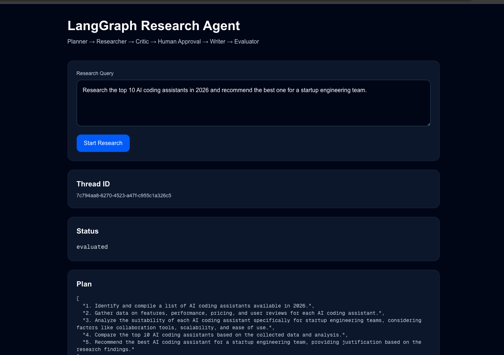
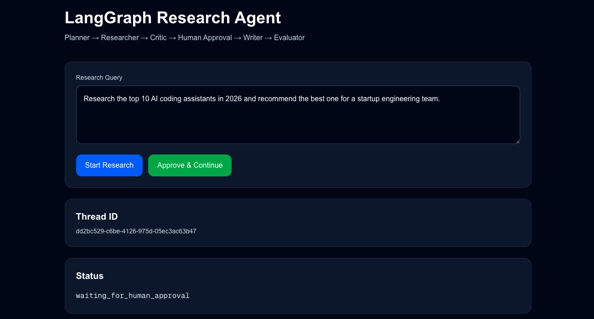
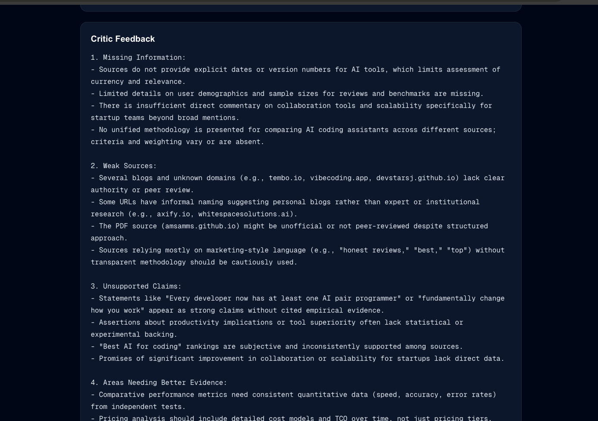
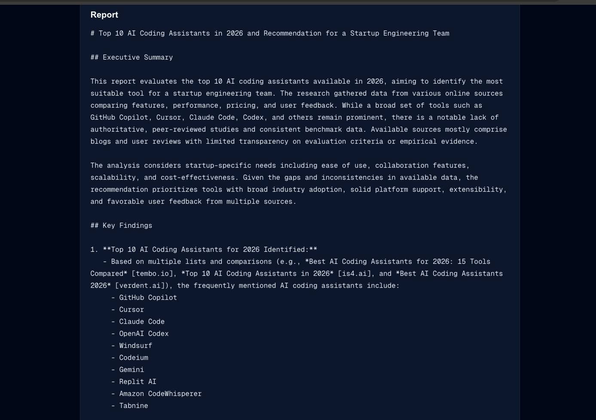
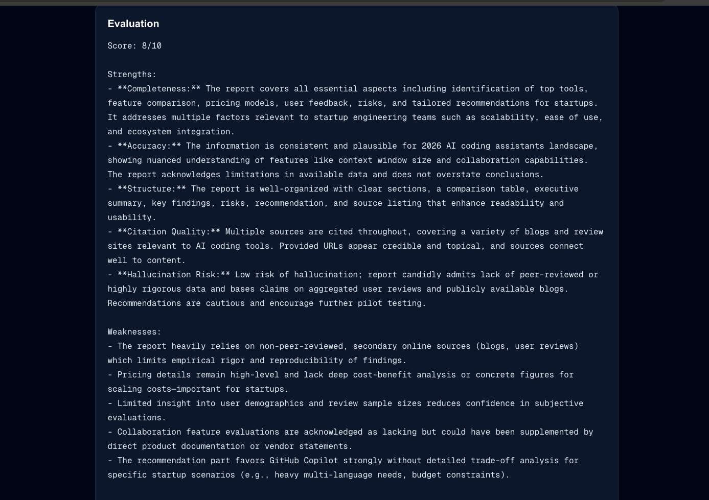

# Multi-Agent-Research-System

A production-style Multi-Agent AI Platform built using LangGraph, FastAPI, OpenAI, and Next.js. The system orchestrates multiple specialized AI agents to perform autonomous research, information validation, report generation, human-in-the-loop approvals, and quality evaluation.

Unlike traditional chatbots, this platform demonstrates real-world agent orchestration patterns used in modern AI systems, including planning, tool usage, state management, evaluation loops, memory persistence, and workflow checkpointing.

---

## Features

### Multi-Agent Architecture

The platform consists of five specialized agents:

* **Planner Agent**

  * Breaks complex user goals into structured research tasks.

* **Research Agent**

  * Performs information gathering using external tools and web searches.

* **Critic Agent**

  * Reviews gathered information.
  * Identifies missing data, weak evidence, and unsupported claims.

* **Writer Agent**

  * Generates structured reports based on validated findings.

* **Evaluator Agent**

  * Scores the quality of generated reports.
  * Provides feedback for continuous improvement.

---

### LangGraph Orchestration

The system uses LangGraph to coordinate agent interactions and workflow execution.

Capabilities include:

* Stateful workflows
* Agent-to-agent communication
* Checkpointing
* Workflow persistence
* Conditional routing
* Human approval checkpoints
* Retry and evaluation loops

---

### Human-in-the-Loop Approval

Before generating the final report, the workflow pauses and waits for user approval.

This simulates real-world enterprise AI systems where sensitive actions require human verification.

---

### Evaluation Driven Workflow

Generated reports are evaluated automatically.

The Evaluator Agent analyzes:

* Completeness
* Structure
* Accuracy
* Citation quality
* Hallucination risk

Low-quality outputs can be routed back through the workflow for improvement.

---

### Persistent State Management

Each workflow execution is tracked using a unique thread identifier.

This enables:

* Workflow recovery
* State inspection
* Execution history
* Future workflow continuation

---

## System Architecture

```text
User Query
      │
      ▼
Planner Agent
      │
      ▼
Research Agent
      │
      ▼
Critic Agent
      │
      ▼
Human Approval
      │
      ▼
Writer Agent
      │
      ▼
Evaluator Agent
      │
      ▼
Final Report
```

---
## Screenshots

### Home Page



### Human Approval Step



### Critic Feedback



### Final Report



### Evaluation



## Workflow Lifecycle

### Step 1: Planning

The Planner Agent converts a user request into actionable research steps.

Example:

```text
Research AI Agent Frameworks
```

Becomes:

```text
1. Analyze LangGraph
2. Analyze CrewAI
3. Analyze AutoGen
4. Compare architectures
5. Generate recommendations
```

### Step 2: Research

The Research Agent gathers information and stores findings.

### Step 3: Critique

The Critic Agent validates research quality and identifies gaps.

### Step 4: Human Approval

The workflow pauses for user verification.

### Step 5: Report Generation

The Writer Agent generates a professional report.

### Step 6: Evaluation

The Evaluator Agent scores the final output and provides recommendations.

---

## Tech Stack

### Backend

* Python
* FastAPI
* LangGraph
* OpenAI API
* Pydantic

### Frontend

* Next.js
* TypeScript
* React

### AI Components

* Planner Agent
* Research Agent
* Critic Agent
* Writer Agent
* Evaluator Agent

### Utilities

* Requests
* BeautifulSoup
* dotenv

---

## Project Structure

```text
multi-agent-intelligence-platform/
│
├── backend/
│   ├── main.py
│   ├── workflow.py
│   ├── langgraph_workflow.py
│   └── state.py
│
├── agents/
│   ├── planner.py
│   ├── researcher.py
│   ├── critic.py
│   ├── writer.py
│   └── evaluator.py
│
├── tools/
│   └── search_tool.py
│
├── memory/
│   └── store.py
│
├── frontend/
│
├── requirements.txt
└── .env
```

---

## API Endpoints

### Start Research Workflow

```http
POST /langgraph/start
```

Request:

```json
{
  "query": "Compare LangGraph, CrewAI, AutoGen, OpenAI Agents SDK, and Semantic Kernel"
}
```

---

### Approve Workflow

```http
POST /langgraph/approve
```

Request:

```json
{
  "thread_id": "workflow-thread-id"
}
```

---

### View Workflow State

```http
GET /langgraph/state/{thread_id}
```

Returns current workflow state and execution progress.

---

## Example Research Queries

### AI Framework Comparison

```text
Compare LangGraph, CrewAI, AutoGen, OpenAI Agents SDK, and Semantic Kernel for production AI systems.
```

### Multi-Agent System Design

```text
Design a scalable multi-agent customer support platform capable of handling one million conversations per month.
```

### Enterprise AI Architecture

```text
Research how leading AI companies implement planning, memory, tool calling, evaluation, and observability in production agent systems.
```

---

## Future Enhancements

* Vector Database Memory
* RAG Integration
* Multi-Agent Collaboration
* MCP Tool Integration
* LangSmith / Langfuse Observability
* Knowledge Graph Memory
* Autonomous Planning Loops
* Tool Routing Agents
* Fact Verification Agents
* Citation Validation Agents
* Kubernetes Deployment
* Docker Support
* Multi-Modal Agent Workflows

---

## Key Concepts Demonstrated

* Agentic AI Systems
* Multi-Agent Architecture
* LangGraph Orchestration
* Human-in-the-Loop AI
* Workflow Checkpointing
* Agent Evaluation Loops
* State Management
* AI Report Generation
* AI System Design
* Production AI Patterns

---

## Author

Nikhil Krishnaprasad


Focused on:

* Artificial Intelligence
* Agentic AI Systems
* Backend Engineering
* Distributed Systems
* Large Language Models
* Production AI Infrastructure

